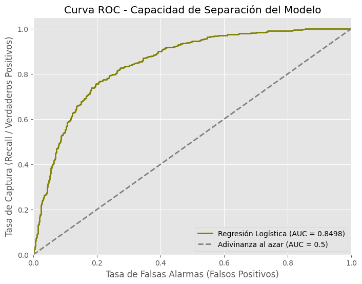
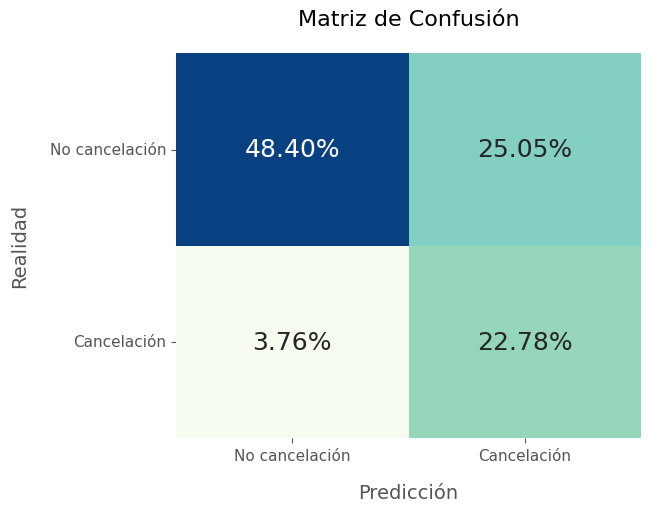
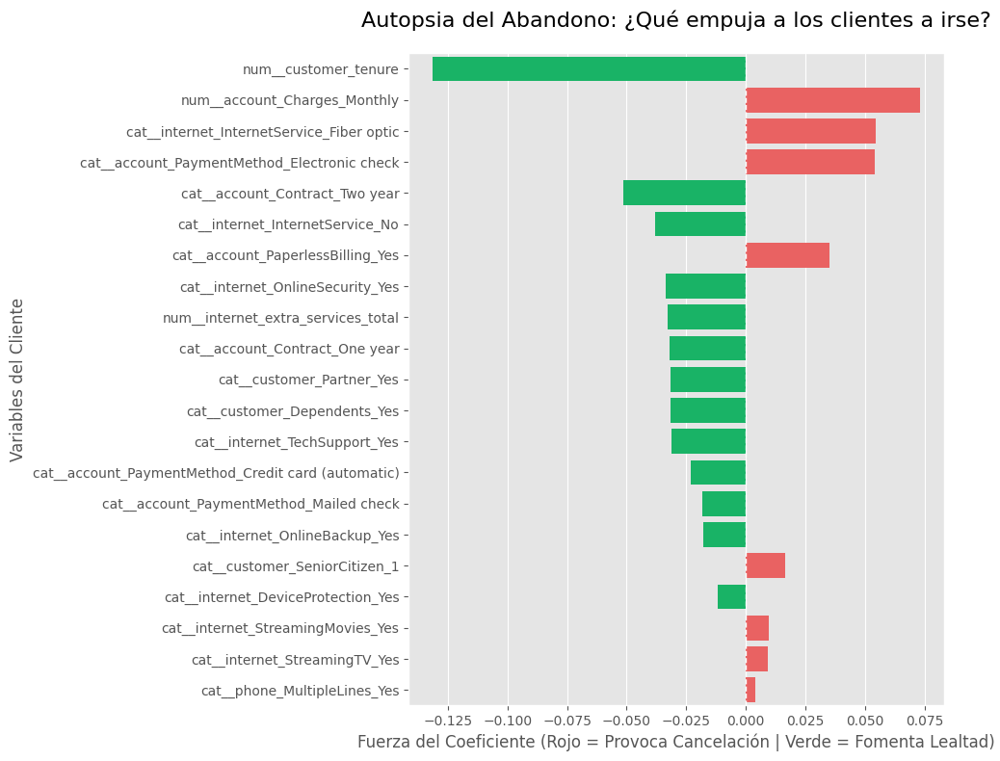

# Telecom X2 - Predicción de Abandono de Clientes (Churn) y Estrategias de Retención

## Objetivo del Proyecto
El objetivo de este proyecto es desarrollar un modelo predictivo capaz de identificar
proactivamente a los clientes con alto riesgo de cancelación (Churn) en una empresa
de telecomunicaciones, analizar los factores de su decisión y proponer estrategias
de retención basadas en los datos.

## Metodología 

* **Análisis Inicial:** Se realizó la limpieza de los datos y mediante un análisis
exploratorio por medio de gráficos y métricas, se determinaron las variables a utilizar
en el modelo, eliminando aquellas que no influían significativamente en el abandono y 
las que presentaban alta colinealidad generando ruido estadístico.
* **Selección de Modelo:** Se hizo el entrenamiento de tres modelos distintos: Regresión
Logística, Bosque Aleatorio y SVM con los parámetros por defecto y se analizaron sus
métricas, priorizando el **Recall** (Sensibilidad o tasa de Verdaderos Positivos) que 
mide la exhaustividad del modelo, permitiendo predecir las cancelaciones con mayor certeza, 
a costa de una mayor tasa de Falsos Positivos. Esto debido a que en nuestro caso de uso,
es preferible asumir el costo de enviar promociones a falsos positivos que perder
los ingresos recurrentes de un cliente real, ya que el costo de obtener un nuevo cliente
puede ser de 5 a 25 veces más alto que retener uno ya existente (https://www.yotpo.com/blog/cost-of-customer-acquisition-vs-retention/)

## Decisiones Técnicas
* **Feature Engineering:** Se generó una variable sintética que suma la cantidad de servicios adicionales contratados ligados al servicio de internet.
Esta métrica representa el Costo de Cambio del cliente. A mayor número de servicios integrados, mayor es la fricción logística y psicológica para cancelar el contrato (efecto stickiness).

* **Manejo del Desbalanceo:** Se identificó una proporción de 3:1 entre clientes leales
y fugitivos. Se implementó la técnica `SMOTE` dentro de un `Pipeline` estricto para generar 
datos sintéticos y evitar la fuga de datos (Data Leakage) durante el entrenamiento.
* **Optimización Orientada al Negocio:** El ajuste de hiperparámetros (`GridSearchCV`)
priorizando la métrica **Recall**, sobre una variaded de hiperparáemtros para encontrar
la combinación que tuviera el mejor desempeño.

## Rendimiento del Modelo Final (Regresión Logística)
El modelo demostró una gran capacidad de separación con un **AUC ROC de 0.8498**.

Sus métricas clave de negocio son:

* **Recall: 0.86** | El modelo atrapa exitosamente al 86% de los clientes que están a punto de cancelar.
* **Precision: 0.48** | De las alertas generadas, casi la mitad resultan en cancelaciones reales, un "costo de hacer negocios" aceptable para mantener la red de captura amplia.

## Principales Factores de Cancelación (Autopsia del Modelo)
A través de los coeficientes penalizados (Regularización L2), se identificaron las variables con mayor peso en la decisión del cliente:

Los **cargos mensuales** es el factor de riesgo número uno. Los clientes son altamente
sensibles al precio total de su factura.

Aunque el modelo identificó a la **fibra óptica** como un fuerte detonante de cancelación,
el Análisis Exploratorio (EDA) previo reveló un efecto de interacción clave: el abandono
no ocurre solo por tener fibra, sino cuando la fibra se empaqueta con múltiples servicios
adicionales. A diferencia de las conexiones DSL, agregar servicios a la Fibra Óptica
dispara el Cargo Mensual a un umbral de poca tolerancia para el cliente.

El **tipo de contrato** es otro factor muy importante, tanto los contratos a dos años como a
un año tienen presentan un coeficiente altamente negativo, dejando los contratos mes a mes
como un motivo de cancelación alto (no visible en la gráfica ya que queda implícito con el
One-Hot encoding cuando las otras dos modalidades son falsas), esto se confirma aún más al
ver que el tipo de pago con **cheque electrónico** tiene un impacto positivo alto en las
cancelaciones.

La **antigüedad** o tenure Funciona como el principal ancla de lealtad. A mayor tiempo
en la empresa, el riesgo de fuga se desploma.

## Estrategias de Retención Propuestas
Basado en los hallazgos matemáticos, se proponen las siguientes acciones directas:
1. **Migración a Cargo Automático (Reducción de Fricción)**
Incentivar el cambio de método de pago de "Cheque Electrónico" a tarjeta de crédito mediante un descuento único. Esto vuelve el cobro "invisible" y elimina la consciencia del gasto manual mes a mes, reduciendo cancelaciones impulsivas.

2. Migración Proactiva de Contratos (Up-selling)
Reducir la dependencia del contrato "Mes a Mes" (principal predictor de fuga). Se ofrecerán beneficios atractivos, como servicios extra gratis por tiempo limitado, a los clientes mensuales que cumplan 6 meses para motivarlos a firmar plazos de 1 o 2 años.

3. Blindaje del Primer Año (Onboarding)
Concentrar los presupuestos de retención y servicio al cliente en los primeros meses de vida del usuario. El modelo demuestra que una vez superada la barrera inicial de antigüedad (Tenure), la volatilidad del cliente y el riesgo de abandono caen drásticamente.

4. Experiencia "Fibra Premium"
Justificar el alto costo de la fibra óptica mediante un programa de atención prioritaria. Transformar un gasto que hoy se percibe como excesivo en un verdadero servicio premium, ofreciendo seguimiento técnico intensivo que no esté disponible en conexiones DSL.

5. Empaquetamiento Inteligente de Servicios
Ofrecer planes modulares (ej. internet sin telefonía) con costos reducidos por cada servicio adicional contratado. Esto otorga a los clientes un mayor costo-beneficio, protegiendo la métrica de cargos mensuales  a cambio de fidelización a largo plazo.
